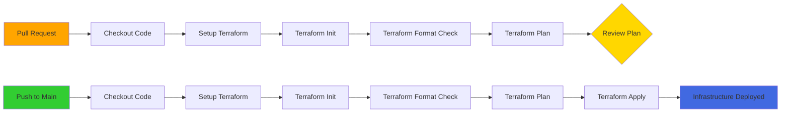

# TerraformTest

[](https://www.terraform.io/)
[](https://azure.microsoft.com/)
[](https://github.com/features/actions)
[](LICENSE)

> 🚀 Automated Azure infrastructure deployment with Terraform and GitHub Actions

A production-ready CI/CD pipeline for Azure infrastructure automation using Terraform and GitHub Actions with Service Principal authentication.

## ✨ Features

- 🔄 **Automated CI/CD** - GitHub Actions workflow for seamless deployments
- 🔐 **Secure Authentication** - Azure Service Principal integration
- ✅ **Code Quality** - Automatic Terraform formatting checks
- 📋 **Plan Preview** - Review infrastructure changes in pull requests
- 🚀 **Auto Deploy** - Automatic apply on merge to main branch

## 📋 Prerequisites

- Azure subscription
- [Azure CLI](https://docs.microsoft.com/cli/azure/install-azure-cli) installed
- [Terraform](https://www.terraform.io/downloads) v1.13+ installed
- GitHub repository with Actions enabled
- `jq` for JSON parsing (optional)

## 🚀 Quick Start

### 1. Create Azure Service Principal

```bash
az account set --subscription "<your-subscription-name>"
subscriptionId=$(az account show | jq -r '.id')
sp=$(az ad sp create-for-rbac --name "TerraformSP" --role Contributor --scopes /subscriptions/$subscriptionId)
```

### 2. Configure GitHub Secrets

Navigate to `Settings` → `Secrets and variables` → `Actions` and add:

| Secret | Description |
|--------|-------------|
| `ARM_CLIENT_ID` | Service Principal App ID |
| `ARM_CLIENT_SECRET` | Service Principal Password |
| `ARM_TENANT_ID` | Azure Tenant ID |
| `ARM_SUBSCRIPTION_ID` | Azure Subscription ID |

**Or use GitHub CLI:**

```bash
gh secret set ARM_CLIENT_ID --body "<app-id>"
gh secret set ARM_CLIENT_SECRET --body "<password>"
gh secret set ARM_TENANT_ID --body "<tenant-id>"
gh secret set ARM_SUBSCRIPTION_ID --body "<subscription-id>"
```

## 🔄 CI/CD Workflow



### Pull Requests
- ✅ Validates Terraform formatting
- ✅ Initializes working directory
- ✅ Generates execution plan for review

### Push to Main
- ✅ All PR checks
- ✅ Automatic infrastructure deployment

## 💻 Local Development

Set environment variables for local Terraform execution:

```bash
export ARM_CLIENT_ID="<app-id>"
export ARM_CLIENT_SECRET="<password>"
export ARM_TENANT_ID="<tenant-id>"
export ARM_SUBSCRIPTION_ID="<subscription-id>"

terraform init
terraform plan
terraform apply
```

## 📚 Documentation

- [CI/CD Setup Guide](CICD%20with%20GitHub%20Actions%20%26%20DevOps%20Integration.md) - Detailed setup instructions
- [Terraform Documentation](https://www.terraform.io/docs) - Official Terraform docs
- [Azure Provider](https://registry.terraform.io/providers/hashicorp/azurerm/latest/docs) - Azure provider reference

## 🤝 Contributing

1. Fork the repository
2. Create a feature branch (`git checkout -b feature/amazing-feature`)
3. Commit your changes (`git commit -m 'Add amazing feature'`)
4. Push to the branch (`git push origin feature/amazing-feature`)
5. Open a Pull Request

## 📝 License

This project is licensed under the MIT License.

---

**Built with** ❤️ **using Terraform and GitHub Actions**
